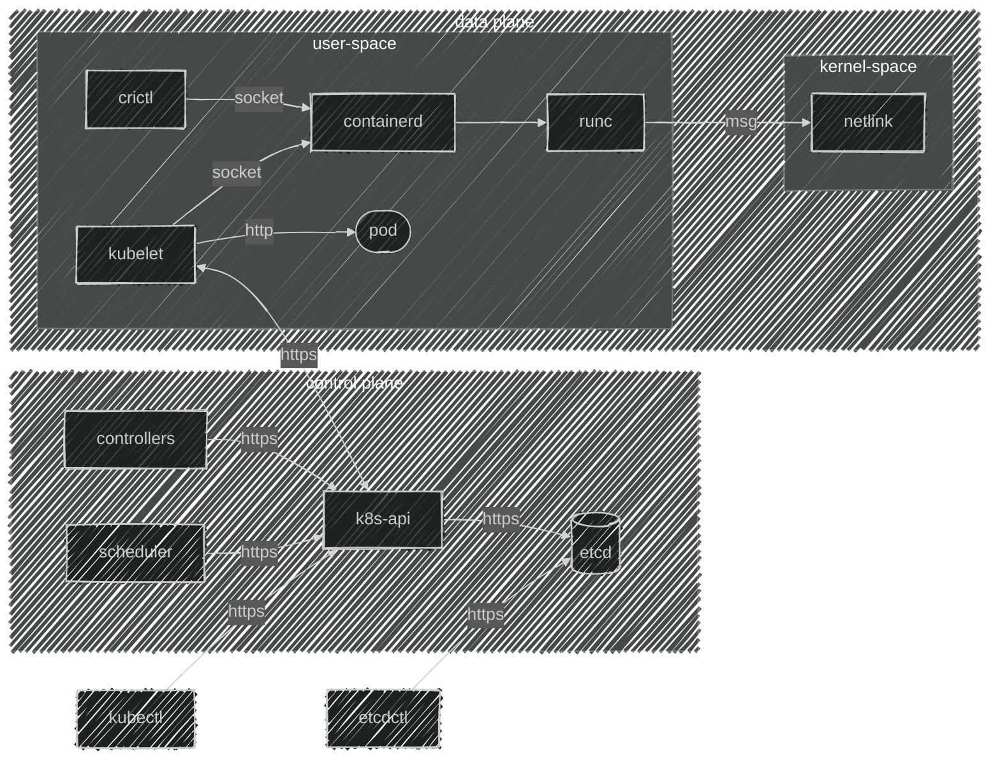

import TopologyInfra          from '@site/docs/tech-docs/kubernetes/flowcharts/topologyInfra.mdx'

# 3. Архитектура
**Описание**: Архитектура Kubernetes основана на принципах микросервисов и масштабируемости. Кластер Kubernetes состоит из двух основных типов компонентов: управляющих и рабочих. Управляющие компоненты отвечают за принятие решений и координацию работы кластера, а рабочие узлы непосредственно выполняют контейнеризованные приложения. Все компоненты Kubernetes взаимодействуют друг с другом через API Server, обеспечивая согласованное управление состоянием кластера.

## 3.1 Основные компоненты архитектуры

1. **Управляющие компоненты (Control Plane)**  
   Управляющие компоненты обеспечивают управление кластером и отвечают за принятие всех решений, таких, как запуск подов, масштабирование и отказоустойчивость. Они обеспечивают работу "мозга" кластера.

   - **API Server**: Центральная точка для всех взаимодействий с кластером, через которую проходят все запросы. Он взаимодействует с базой данных состояния (etcd) и принимает команды от пользователя.
   - **Controller Manager**: Система контроллеров, которая управляет состоянием различных объектов, например, реплика-сетов и деплойментов, гарантируя, что состояние объектов соответствует заданным параметрам.
   - **Scheduler**: Отвечает за распределение подов по узлам, основываясь на текущем состоянии ресурсов и требованиях приложений.
   - **etcd**: Распределённое хранилище данных, которое хранит всю конфигурацию и состояние кластера. Это гарантирует высокую доступность и консистентность данных.

2. **Рабочие узлы (Node)**  
   Рабочие узлы — это вычислительные ресурсы, на которых запускаются контейнеризованные приложения. Каждый рабочий узел содержит компоненты для обеспечения работы контейнеров и связи с управляющими компонентами.

   - **Kubelet**: Агент на каждом рабочем узле, который управляет контейнерами (подами), взаимодействует с контейнерной средой и следит за состоянием контейнеров.
   - **Container Runtime**: Среда для выполнения контейнеров, которая может быть реализована с использованием различных движков, таких как containerd или CRI-O.

## 3.2 Взаимодействие компонентов

Компоненты Kubernetes взаимодействуют через API Server, который служит единым интерфейсом для всех запросов. Например, **kubectl** (CLI-интерфейс) отправляет команды через API Server, который затем обновляет состояние кластера в **etcd**. Контроллеры и планировщик (Scheduler) используют данные из **etcd** для принятия решений о том, где и как запускать поды и управлять ресурсами. **Kubelet** на рабочих узлах взаимодействуют с API Server для обновления состояния и управления трафиком.

## 3.3 Особенности архитектуры

- **Масштабируемость**: Kubernetes поддерживает горизонтальное масштабирование, добавляя новые узлы в кластер и динамически распределяя нагрузку.
- **Отказоустойчивость**: За счёт многократных реплик ключевых компонентов, таких как API Server, etcd и Controller Manager, Kubernetes обеспечивает отказоустойчивость и восстановление после сбоев.
- **Модульность**: Архитектура Kubernetes построена таким образом, что её компоненты могут быть легко заменены или обновлены без значительных нарушений работы системы.
- **Изоляция**: Каждое приложение запускается в своём контейнере (под), обеспечивая изоляцию и независимость работы приложений.

**Архитектура Kubernetes** обеспечивают высокую доступность, масштабируемость и управляемость кластером. Это делает Kubernetes идеальной платформой для автоматизации развертывания, управления и масштабирования контейнеризованных приложений в распределённой среде.

<TopologyInfra />