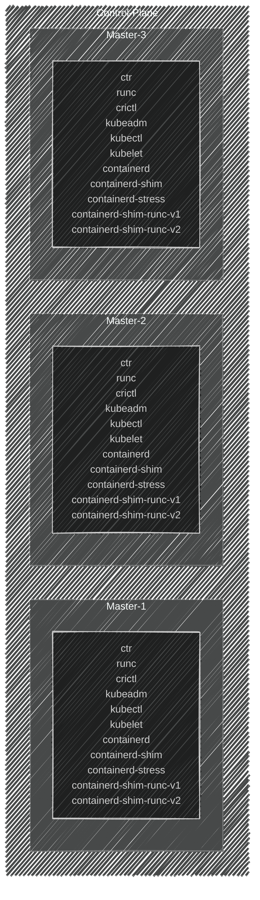

import { FancyboxDiagram }      from '@site/src/components/commonBlocks/FancyboxDiagram'

**Список компонентов с разбивкой по узлам управляющего контура**
  <FancyboxDiagram>

    </FancyboxDiagram>

