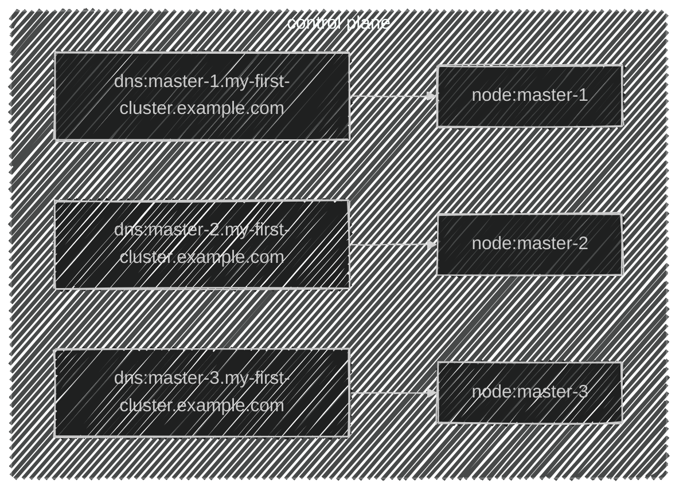
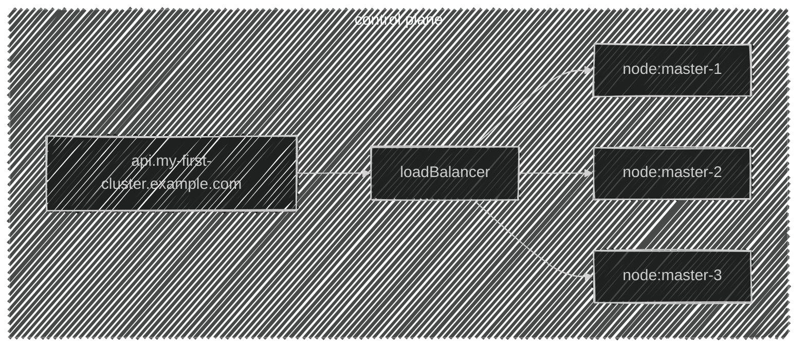

### DNS Записи для узлов управляющего контура

```mermaid
---
config:
  look: handDrawn
  theme: dark
---

flowchart TB
  master1[node:master-1]
  master2[node:master-2]
  master3[node:master-3]

  dnsMaster1[dns:master-1.my-first-cluster.example.com]
  dnsMaster2[dns:master-2.my-first-cluster.example.com]
  dnsMaster3[dns:master-3.my-first-cluster.example.com]


  subgraph control plane
      dnsMaster1-->master1
      dnsMaster2-->master2
      dnsMaster3-->master3
   end
```

### DNS Запись плюс балансировщик для узлов управляющего контура

```mermaid
---
config:
  look: handDrawn
  theme: dark
---

flowchart TB
  loadBalancer[loadBalancer]
  master1[node:master-1]
  master2[node:master-2]
  master3[node:master-3]

  subgraph control plane
      api.my-first-cluster.example.com-->loadBalancer
      loadBalancer-->master1
      loadBalancer-->master2
      loadBalancer-->master3
   end

```

