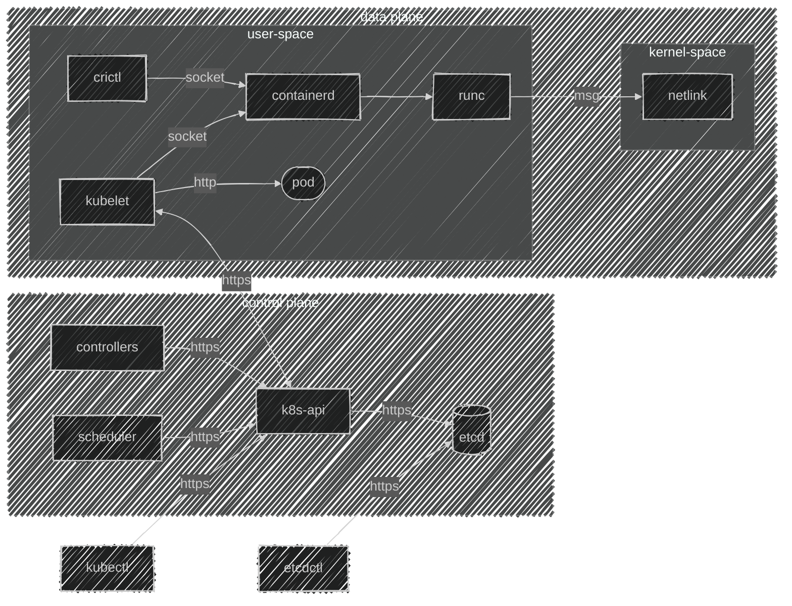

import TopologyInfra          from '@site/i18n/en/docusaurus-plugin-content-docs/current/tech-docs/kubernetes/flowcharts/topologyInfra.mdx'

# 3. Architecture
**Description**: Kubernetes architecture is based on the principles of microservices and scalability. A Kubernetes cluster consists of two main types of components: control plane and worker. Control plane components are responsible for decision-making and coordinating cluster operations, while worker nodes directly run containerized applications. All Kubernetes components interact with each other through the API Server, ensuring consistent management of the cluster state.

## 3.1 Main Architecture Components

1. **Control Plane Components**  
   Control plane components manage the cluster and are responsible for all decisions, such as starting pods, scaling, and fault tolerance. They serve as the "brain" of the cluster.

   - **API Server**: The central point for all interactions with the cluster, through which all requests pass. It interacts with the state database (etcd) and accepts commands from the user.
   - **Controller Manager**: A system of controllers that manages the state of various objects, such as replica sets and deployments, ensuring that the state of objects matches the specified parameters.
   - **Scheduler**: Responsible for distributing pods across nodes based on the current resource state and application requirements.
   - **etcd**: A distributed data store that stores all configuration and cluster state. This guarantees high availability and data consistency.

2. **Worker Nodes (Node)**  
   Worker nodes are computing resources on which containerized applications run. Each worker node contains components to support container operations and communication with control plane components.

   - **Kubelet**: An agent on each worker node that manages containers (pods), interacts with the container runtime, and monitors the state of containers.
   - **Container Runtime**: The environment for running containers, which can be implemented using various engines such as containerd or CRI-O.

## 3.2 Component Interaction

Kubernetes components interact through the API Server, which serves as a unified interface for all requests. For example, **kubectl** (CLI interface) sends commands through the API Server, which then updates the cluster state in **etcd**. Controllers and the Scheduler use data from **etcd** to make decisions about where and how to run pods and manage resources. **Kubelet** on worker nodes interacts with the API Server to update state and manage traffic.

## 3.3 Architecture Features

- **Scalability**: Kubernetes supports horizontal scaling by adding new nodes to the cluster and dynamically distributing the load.
- **Fault Tolerance**: Through multiple replicas of key components such as API Server, etcd, and Controller Manager, Kubernetes ensures fault tolerance and recovery after failures.
- **Modularity**: Kubernetes architecture is built so that its components can be easily replaced or updated without significant disruptions to the system.
- **Isolation**: Each application runs in its own container (pod), providing isolation and independent operation of applications.

**Kubernetes architecture** ensures high availability, scalability, and cluster manageability. This makes Kubernetes an ideal platform for automating the deployment, management, and scaling of containerized applications in a distributed environment.

<TopologyInfra />
